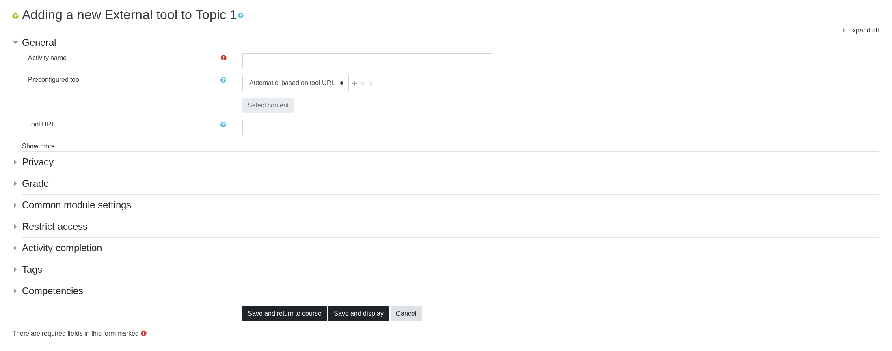
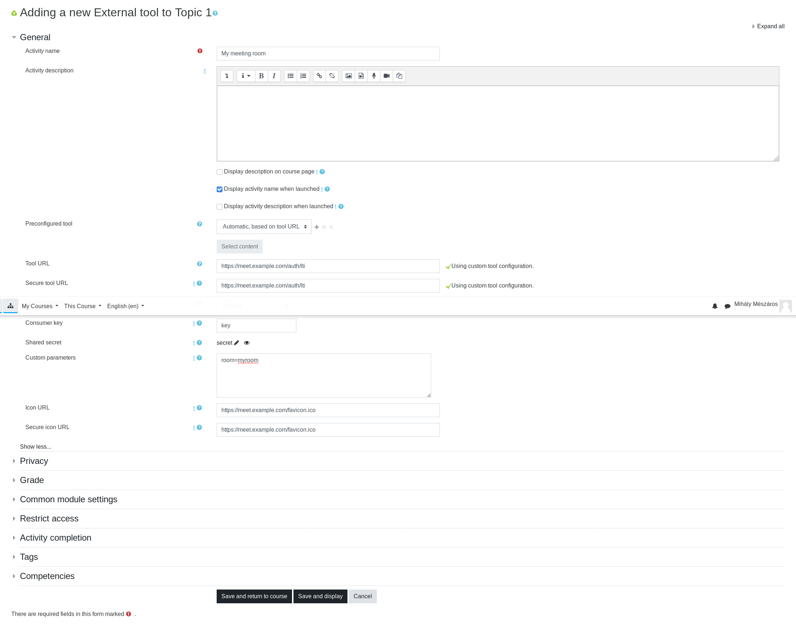

# Learning Tools Interoperability (LTI)

## LTI

Read more about IMS Global defined interface for tools like our VideoConference system integration with Learning Management Systems(LMS) (e.g. moodle).
See: [IMS Global Learning Tool Interoperability](https://www.imsglobal.org/activity/learning-tools-interoperability)

We implemented LTI interface version 1.0/1.1

### Server config auth section LTI settings

Set in server configuration a random key and secret

``` json
auth :
    {
        lti :
        {
            consumerKey    : 'key',
            consumerSecret : 'secret'
        },
    }
```

### Configure your LMS system with secret and key settings above

#### Auth tool URL

Set tool URL to your server with path /auth/lti

``` url
https://mm.example.com/auth/lti
```

#### In moodle find external tool plugin setting and external tool action

See: [moodle external tool settings](https://docs.moodle.org/38/en/External_tool_settings)

#### Add and activity


#### Setup Activity

##### Activity setup basic form

Open fully the settings **Click on show more!!**


##### Empty full form


##### Filled out form



## moodle plugin

Alternatively you can use edumeet moodle plugin:
[https://github.com/edumeet/moodle-mod_edumeet](https://github.com/edumeet/moodle-mod_edumeet)
