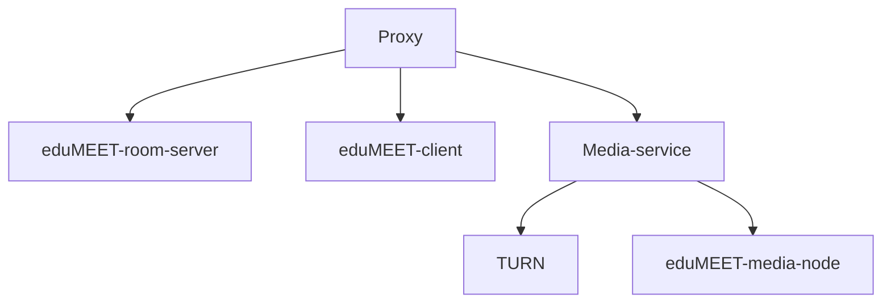
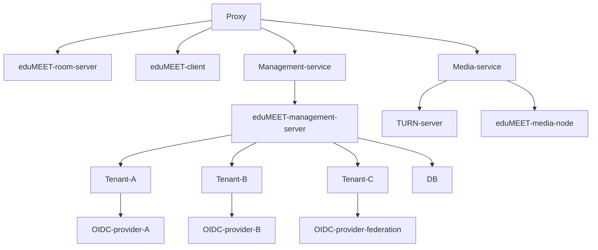
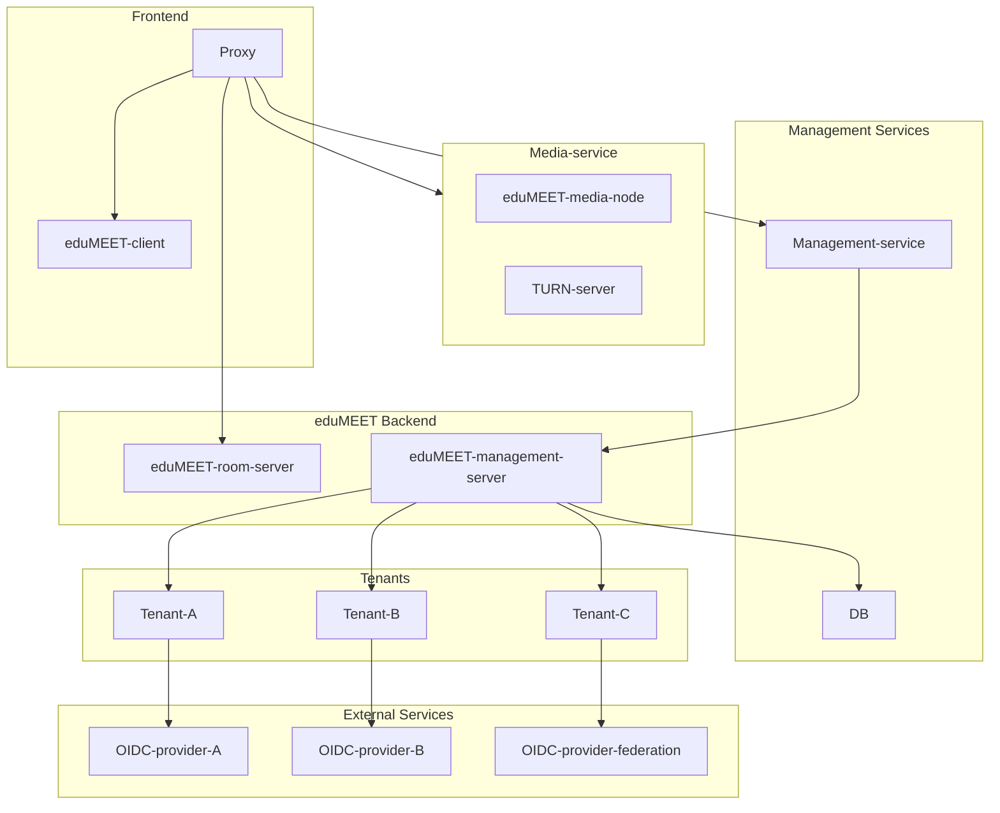
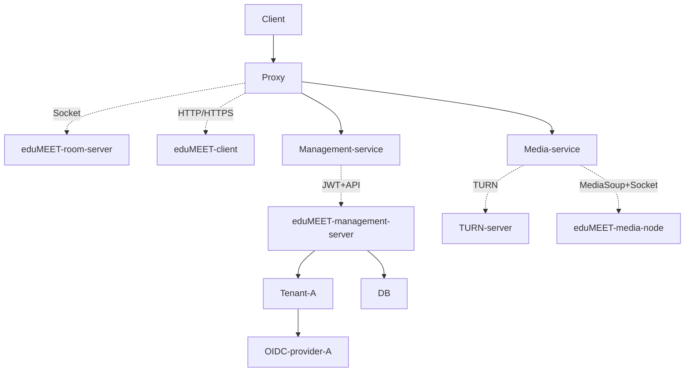

#  **WebRTC meeting service**
Official website: [edumeet.org](https://edumeet.org)

Try it online at [usually.in](https://usually.in)

Join our discord server [here](https://discord.gg/DkD4nj6D)

## Main features

| Feature  | Description |
| ------------- | ------------- |
| **A/V streaming** | Share your microphone and camera + additional video stream  |
| **Screen sharing** | Share your screen to make some presentation right from your desktop |
| **File sharing** | Share your files with the peers (torrent solution under the hood) |
| **Chat messages**  | Text conversation with other participants |
| **Local Recording**  | Record window/tab/screen content in browser supported formats with room audio and save them (**disabled by default**) |
| **Authentication**  | Supported types: **OIDC**, **SAML**, **Local DB** |

## Installation

### Prerequisites
 * Docker and docker-compose
 * Curl
 * If you want to access the service from the internet, you need a public IP address
 * 2 fqdns (one for the main service and one for the turn server) that point to the public IP address
 * Ports 80/tcp, 443/tcp need to be open on the public IP address
 * Ports 40000-40249/udp and 40000-40249/tcp are not strictly necessary, but are recommended for better connectivity

### Architecture
Edumeet simple setup

Edumeet setup with authentication

Edumeet setup with multiple nodes


Edumeet setup - Communication

### Installation steps
1. Run the installation script
```bash
./run-first.sh
```
This will ask you for a main domain and a media domain. It will also ask you for an email address for the certificates, but you can leave it empty if you don't want to receive notifications about the certificates. The script will also ask you for the listen IP of the server as well as the external IP. If you don't have a separate external IP, you can use the same IP for both.

The script will then prepare the certificates and the services. You may inspect and change the values in the .env file as needed. The script will read the .env file and use the values from there if they are present, so you can also set the values in the .env file before running the script. You may delete the .env file to start from scratch.

2. Docker compose
```bash
docker-compose up -d
```
This will start all the services. And you are done. You can now access the service at the main domain you provided.

### Configuration
The configuration for the client is in the `client` folder. You may change it as needed, but no changes are necessary for the service to work.
An example for this configuration file can be found in the [edumeet-client](https://github.com/edumeet/edumeet-client?tab=readme-ov-file#configuration-properties) repository. The configuration for the room-server is in the `room-server` folder. You may change it as needed, but no changes are necessary for the service to work.
An example for this configuration file can be found in the [edumeet-room-server](https://github.com/edumeet/edumeet-room-server?tab=readme-ov-file#configuration-properties) repository.

## Community-driven support
| Type                |                                                |
| -----------         | -----------                                    |
| Open mailing list   | community@lists.edumeet.org                    |
| Subscribe           | lists.edumeet.org/sympa/subscribe/community/   |
| Open archive        | lists.edumeet.org/sympa/arc/community/         |

## Authors

* Håvar Aambø Fosstveit
* Stefan Otto
* Mészáros Mihály
* Roman Drozd
* Rémai Gábor László
* Piotr Pawałowski

## License

MIT License

Contributions to this work were made on behalf of the GÉANT project, a project that has received funding from the European Union’s Horizon 2020 research and innovation programme under Grant Agreement No. 731122 (GN4-2). On behalf of GÉANT project, GÉANT Association is the sole owner of the copyright in all material which was developed by a member of the GÉANT project.

GÉANT Vereniging (Association) is registered with the Chamber of Commerce in Amsterdam with registration number 40535155 and operates in the UK as a branch of GÉANT Vereniging. Registered office: Hoekenrode 3, 1102BR Amsterdam, The Netherlands. UK branch address: City House, 126-130 Hills Road, Cambridge CB2 1PQ, UK.


